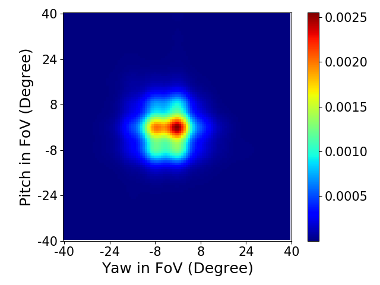
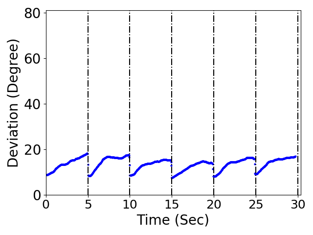
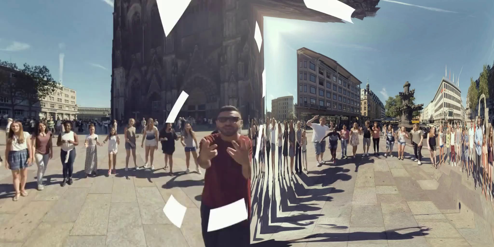
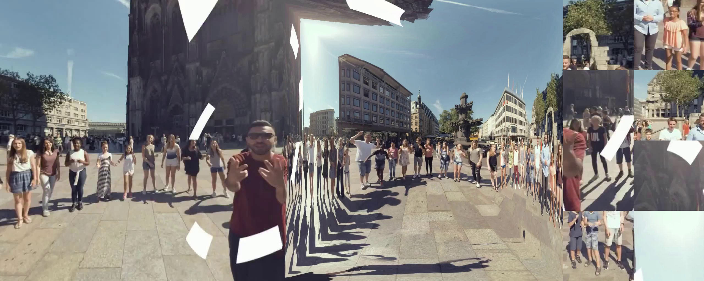

# SALI360
This is python code for the paper work accepted in ACM MMSys'20. You can access to the paper through this link.

## Prerequisities
- Language: Python
- Required Packages: numpy, pandas, matplotlib, scipy, sklearn, scikit-image and opencv
- Need to install 'OpenCV' [link](https://www.pyimagesearch.com/2016/10/24/ubuntu-16-04-how-to-install-opencv/)
- Need to install 'transform360' developed by 'facebook' [link](https://github.com/facebook/transform360)
- The following link would be helpful for installation [link](https://github.com/facebook/transform360/issues/56)
- Need to install 'FFMPEG' [link](https://www.ffmpeg.org/download.html)
- To install the required package, type the following command:

1) Python 2
```
pip install numpy pandas matplotlib scipy sklearn scikit-image
```
2) Python 3
```
pip3 install numpy pandas matplotlib scipy sklearn scikit-image
```

## Dataset
We collected head and eye gaze movement dataset from 20 vonlunteers over 10 360-degree VR video.


### Running the code
- How to generate the eye gaze heat map
```
python3 eye_gaze_heatmap.py
```
The command above would generate the eye gaze heatmap figure shown below in 'figure' directory, named 'eye_gaze_heatmap.png'. 



- How to plot yaw & pitch deviation from center of front face 
```
python3 gaze_deviation.py
python3 gaze_deviation_visualization.py
```
1. The first command 'python3 gaze_deviation.py' calculates the yaw and pitch deviation from the center of front face in cube map representation, which would be saved in a format of 'pickle' file in 'data' directory to be used in the following script. 
2. 'gaze_deviation_visualization.py' would save the deviation plots, each of which would be saved as 'type_of_data'_'duration'.png (e.g., pitch_2.png) in the 'figure' directory. The figure below is 'pitch_5.png that shows the deviation pattern when 5-second-of video segments are streamed. 



- Pyramid encoding in video
1. Extract 'video.zip' file to recover the sample video segment.
2. Run the following command. pyramid-encoded video segment would be found in 'video/segemtns/pyramid_b'. 
```
python3 pyramid_b_encoding.py
```
The pyramid representation would look as below.


- Pyramid decoding in video
1. The following command would convert pyramid representation back into cube represenation. however, even with the same sturcuture as cube format, decocded video would have reduced size and degraded quality, compared to the original cube map represenatation. You can find the decoded video in 'video/segments/decoded'.
```
python3 pyramid_b_decoding.py
```
You can compare the quality of decoded video frame with the original cube frame by clicking the following images below. <br/>
"Original Cube Frame"


"Decoded Frame"


- Calculate saliency scores
The following command would calculate saliency score of video frames and save them in json files (in 'json' directory). To boost up the computation efficiency, we sampled every n-th (in our case 10th) frame for saliency score. 
```
python3 saliency_json.py
```
The content of json file would look as below. Please refer to the paper for the detailed explanation of json files.
```
"{\"0\": {\"saliency\": \"1.0\", \"row\": \"274\", \"column\": \"767\", \"name\": \"L\", \"width\": \"256\"}, \"1\": {\"saliency\": \"0.9852603104565192\", \"row\": \"0\", \"column\": \"892\", \"name\": \"R\", \"width\": \"132\"}, \"2\": {\"saliency\": \"0.9852603104565192\", \"row\": \"0\", \"column\": \"0\", \"name\": \"B\", \"width\": \"124\"}, \"3\": {\"saliency\": \"0.8944914751693509\", \"row\": \"92\", \"column\": \"107\", \"name\": \"B\", \"width\": \"256\"}, \"4\": 
...
```
- Salient Region Concatenation

The following command generates video files whose frames would look as below. sliced salient regions are concatenated to pyramid represenation.
```
python3 salient_region_concatenation.py
```



Saliency Stitching
```
python3 saliency_stitching.py
```
